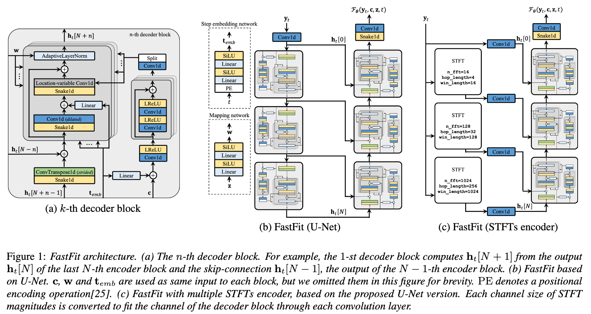

# Table of contents
{:.no_toc}
* toc
{:toc}

# Abstract

This paper presents FastFit, a novel neural vocoder architecture that replaces U-Net's encoder with multiple short-time Fourier transforms (STFTs) to achieve faster generation rates without sacrificing sample quality. We replace each encoder block with an STFT, with parameters equal to the temporal resolution of each decoder block leading to the skip-connection. FastFit reduces the number of parameters and generation time of the model by almost half while maintaining high fidelity. Through objective and subjective evaluations, we demonstrate that the proposed model achieves nearly twice the generation speed of the baseline iteration-based vocoders while maintaining high sound quality. We also show that FastFit produces similar sound quality to other baselines in text-to-speech evaluation scenarios, including multi-speaker and zero-shot text-to-speech.

# Results
* We adopted [LibriTTS](https://openslr.org/60/), a multi-speaker English dataset which has 24 kHz sampling rate waveforms.
* For training models, a 'train-clean-360' dataset was used.
* For ground-truth mel-spectrogram evaluation (GT mel evaluation) including the ablation study, a 'test-clean' dataset was prepared.

## Comparison with baselines
<table>
    <thead>
        <th>Models</th>
        <th>#1</th>
        <th>#2</th>
        <th>#3</th>
        <th>#4</th>
        <th>#5</th>
    </thead>
    <tbody>
        <tr>
            <th>Recordings</th>
            <td><audio controls style="width: 150px;"><source src="wav_for_demo/seen/ground_truth/2004_147967_000029_000002.wav" type="audio/wav"></audio></td>
            <td><audio controls style="width: 150px;"><source src="wav_for_demo/seen/ground_truth/337_126286_000008_000000.wav" type="audio/wav"></audio></td>
            <td><audio controls style="width: 150px;"><source src="wav_for_demo/seen/ground_truth/3537_5704_000008_000005.wav" type="audio/wav"></audio></td>
            <td><audio controls style="width: 150px;"><source src="wav_for_demo/seen/ground_truth/5319_84357_000005_000004.wav" type="audio/wav"></audio></td>
            <td><audio controls style="width: 150px;"><source src="wav_for_demo/seen/ground_truth/6294_86679_000035_000004.wav" type="audio/wav"></audio></td>
        </tr>
    </tbody>
    <tbody>
        <tr>
            <th>MelGAN</th>
            <td><audio controls style="width: 150px;"><source src="wav_for_demo/seen/melgan/2004_147967_000029_000002.wav" type="audio/wav"></audio></td>
            <td><audio controls style="width: 150px;"><source src="wav_for_demo/seen/melgan/337_126286_000008_000000.wav" type="audio/wav"></audio></td>
            <td><audio controls style="width: 150px;"><source src="wav_for_demo/seen/melgan/3537_5704_000008_000005.wav" type="audio/wav"></audio></td>
            <td><audio controls style="width: 150px;"><source src="wav_for_demo/seen/melgan/5319_84357_000005_000004.wav" type="audio/wav"></audio></td>
            <td><audio controls style="width: 150px;"><source src="wav_for_demo/seen/melgan/6294_86679_000035_000004.wav" type="audio/wav"></audio></td>
        </tr>
    </tbody>
    <tbody>
        <tr>
            <th>Parallel WaveGAN</th>
            <td><audio controls style="width: 150px;"><source src="wav_for_demo/seen/pwg/2004_147967_000029_000002.wav" type="audio/wav"></audio></td>
            <td><audio controls style="width: 150px;"><source src="wav_for_demo/seen/pwg/337_126286_000008_000000.wav" type="audio/wav"></audio></td>
            <td><audio controls style="width: 150px;"><source src="wav_for_demo/seen/pwg/3537_5704_000008_000005.wav" type="audio/wav"></audio></td>
            <td><audio controls style="width: 150px;"><source src="wav_for_demo/seen/pwg/5319_84357_000005_000004.wav" type="audio/wav"></audio></td>
            <td><audio controls style="width: 150px;"><source src="wav_for_demo/seen/pwg/6294_86679_000035_000004.wav" type="audio/wav"></audio></td>
        </tr>
    </tbody>
    <tbody>
        <tr>
            <th>HiFi-GAN V1</th>
            <td><audio controls style="width: 150px;"><source src="wav_for_demo/seen/hifi-gan/2004_147967_000029_000002.wav" type="audio/wav"></audio></td>
            <td><audio controls style="width: 150px;"><source src="wav_for_demo/seen/hifi-gan/337_126286_000008_000000.wav" type="audio/wav"></audio></td>
            <td><audio controls style="width: 150px;"><source src="wav_for_demo/seen/hifi-gan/3537_5704_000008_000005.wav" type="audio/wav"></audio></td>
            <td><audio controls style="width: 150px;"><source src="wav_for_demo/seen/hifi-gan/5319_84357_000005_000004.wav" type="audio/wav"></audio></td>
            <td><audio controls style="width: 150px;"><source src="wav_for_demo/seen/hifi-gan/6294_86679_000035_000004.wav" type="audio/wav"></audio></td>
        </tr>
    </tbody>
        <tbody>
        <tr>
            <th>UnivNet-c16</th>
            <td><audio controls style="width: 150px;"><source src="wav_for_demo/seen/univnet-c16/2004_147967_000029_000002.wav" type="audio/wav"></audio></td>
            <td><audio controls style="width: 150px;"><source src="wav_for_demo/seen/univnet-c16/337_126286_000008_000000.wav" type="audio/wav"></audio></td>
            <td><audio controls style="width: 150px;"><source src="wav_for_demo/seen/univnet-c16/3537_5704_000008_000005.wav" type="audio/wav"></audio></td>
            <td><audio controls style="width: 150px;"><source src="wav_for_demo/seen/univnet-c16/5319_84357_000005_000004.wav" type="audio/wav"></audio></td>
            <td><audio controls style="width: 150px;"><source src="wav_for_demo/seen/univnet-c16/6294_86679_000035_000004.wav" type="audio/wav"></audio></td>
        </tr>
    </tbody>
        <tbody>
        <tr>
            <th>UnivNet-c32</th>
            <td><audio controls style="width: 150px;"><source src="wav_for_demo/seen/univnet-c32/2004_147967_000029_000002.wav" type="audio/wav"></audio></td>
            <td><audio controls style="width: 150px;"><source src="wav_for_demo/seen/univnet-c32/337_126286_000008_000000.wav" type="audio/wav"></audio></td>
            <td><audio controls style="width: 150px;"><source src="wav_for_demo/seen/univnet-c32/3537_5704_000008_000005.wav" type="audio/wav"></audio></td>
            <td><audio controls style="width: 150px;"><source src="wav_for_demo/seen/univnet-c32/5319_84357_000005_000004.wav" type="audio/wav"></audio></td>
            <td><audio controls style="width: 150px;"><source src="wav_for_demo/seen/univnet-c32/6294_86679_000035_000004.wav" type="audio/wav"></audio></td>
        </tr>
    </tbody>
</table>

## Application to text-to-speech synthesis
* For multi-speaker TTS, we trained the [JDI-T](https://arxiv.org/abs/2005.07799) acoustic model using the LibriTTS 'train-clean-360' subset with 100 speakers.
* For zero-shot TTS evaluation, we used an open-source TTS program named [TorToiSe](https://github.com/neonbjb/tortoise-tts).
  - The recordings of the LibriTTS ’test-clean’ subset with 10 speakers were input into the program with an 'ultra-fast' offset to synthesize mel-spectrograms for evaluation.
* Each vocoder was not fine-tuned with these predicted mel-spectrograms.

## Ablation studies
